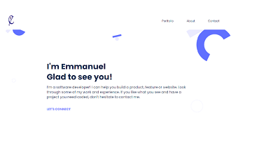

# Emmanuel's Portfolio
​
My personal portfolio that showcases few of my projects and web design capabilities through ecstatic web design.

## Built With
​
- HTML
- CSS
- JS
- Linters

## Live Demo

[Live Demo Link](https://epal-portfolio-setup.netlify.app/)
​
## Getting Started
To get a local copy up and running, follow these simple steps:

- copy this link `https://github.com/Epaltechs/Setup-Portfolio.git`.
- get the directory that you want to clone the repository.
- open the command prompt in this directory.
- write `git clone https://github.com/Epaltechs/Setup-Portfolio/tree/Desktop-Version.`
- go to the repository folder in your command prompt `cd Setup-Portfolio`

👤 **Author**

## Emmnanuel Paul

- GitHub: (https://github.com/Epaltechs)
- Twitter: [https://twitter.com/@emmapaul247]
- LinkedIn: [https://www.linkedin.com/in/emmanuel-s-paul]
- AngeList: [https://angel.co/u/emmanuel-s-paul]
​
## 🤝 Contributor

#### Rwubakwanayo Olivier

Contributions, issues, and feature requests are welcome!

Feel free to check the [issues page](https://github.com/Epaltechs/Setup-Portfolio/issues).

## Show your support
​
If you like this project you can support just by giving a like.
Emmanuel Paul to Everyone (10:25)

## Acknowledgments
Many thanks to Rwubakwanayo Olivier for your wonderful support.

## 📝 License

This project is [MIT](./MIT.md) licensed.
